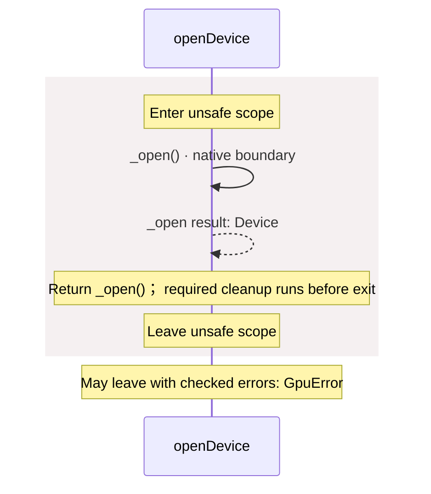
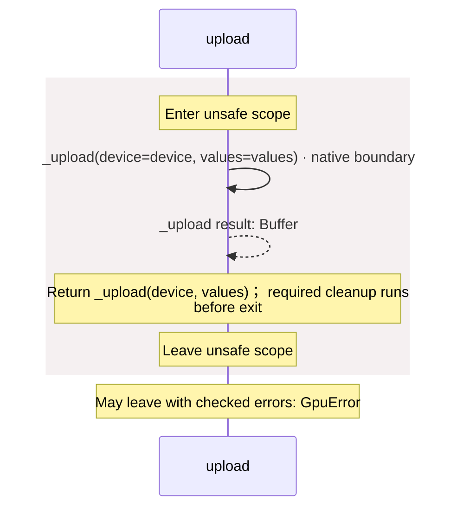
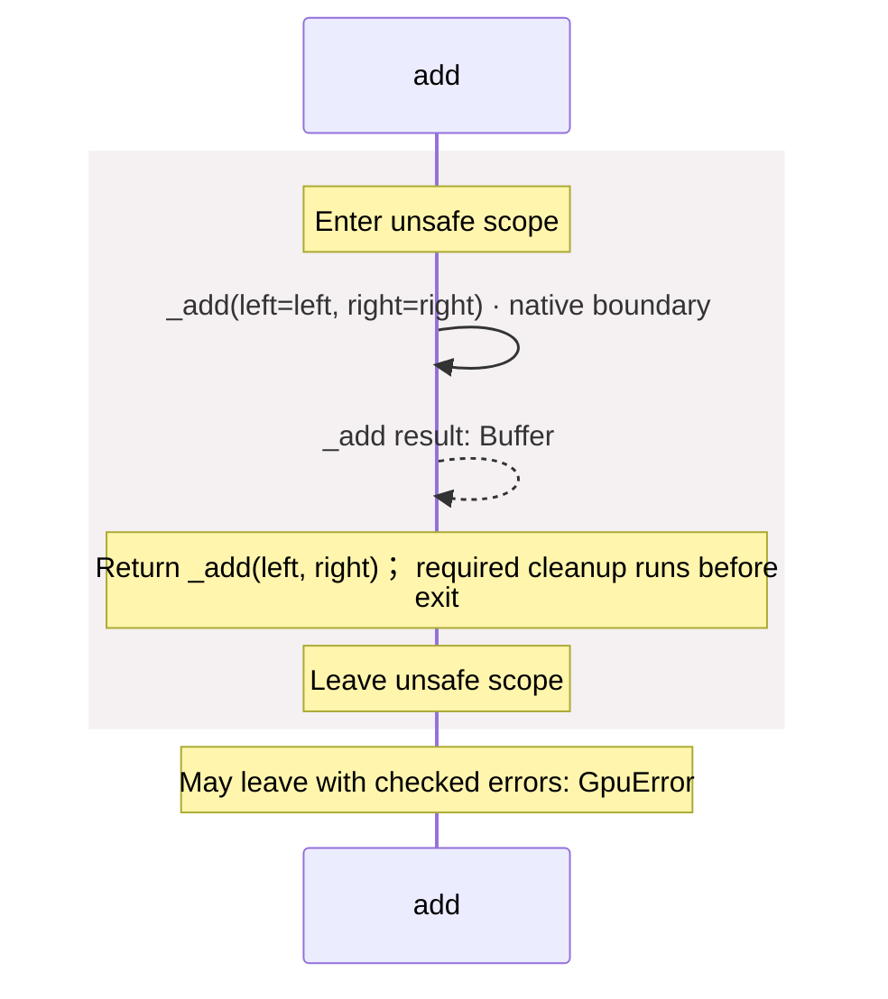
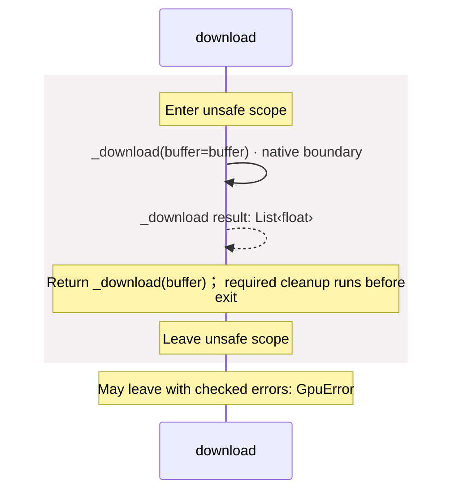

<!-- Generated by aug spec. Edit the August source, then regenerate. -->

# src/api.aug diagrams

[Project overview](../.aug-spec/diagrams/index.md) · [Compiled explanation](api.aug.md)

## Sequences

Call arrows identify checked targets; loop and branch frames determine when they run. Open that target’s module to follow its implementation. Branches describe alternatives; loops describe repeated work. Native calls and interface dispatch stop at their declared contracts. Exit notes end that path; enclosing recovery and cleanup remain visible.

### \_open

[Source](api.aug#L4)

May leave with checked errors: GpuError. Native implementation; only the declared contract is known. [Explanation](api.aug.md).

### \_upload

[Source](api.aug#L5)

May leave with checked errors: GpuError. Native implementation; only the declared contract is known. [Explanation](api.aug.md).

### \_add

[Source](api.aug#L6)

May leave with checked errors: GpuError. Native implementation; only the declared contract is known. [Explanation](api.aug.md).

### \_download

[Source](api.aug#L7)

May leave with checked errors: GpuError. Native implementation; only the declared contract is known. [Explanation](api.aug.md).

### \_live

[Source](api.aug#L8)

Native implementation; only the declared contract is known. [Explanation](api.aug.md).

### openDevice

[Source](api.aug#L10)

### upload

[Source](api.aug#L14)

### add

[Source](api.aug#L18)

### download

[Source](api.aug#L22)

## Called contracts

- [\_add](api.aug.diagrams.md#sequence-_add) — src/api.aug
- [\_download](api.aug.diagrams.md#sequence-_download) — src/api.aug
- [\_live](api.aug.diagrams.md#sequence-_live) — src/api.aug
- [\_open](api.aug.diagrams.md#sequence-_open) — src/api.aug
- [\_upload](api.aug.diagrams.md#sequence-_upload) — src/api.aug
- [add](api.aug.diagrams.md#sequence-add) — src/api.aug
- [download](api.aug.diagrams.md#sequence-download) — src/api.aug
- [openDevice](api.aug.diagrams.md#sequence-openDevice) — src/api.aug
- [upload](api.aug.diagrams.md#sequence-upload) — src/api.aug
